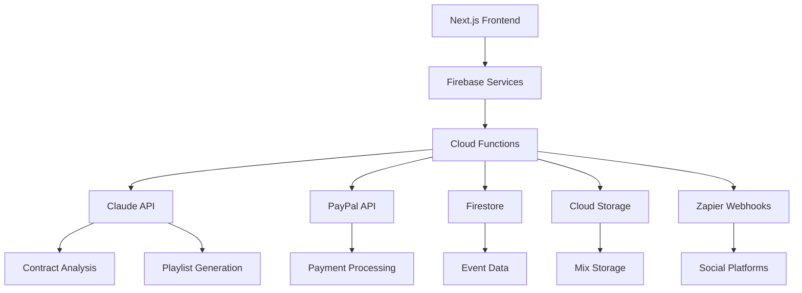

# DJ Booking & Auto-Promotion Platform Architecture

## System Overview

## Key Components
- **AI Services**: Claude integration for contract analysis and content generation
- **Payment**: PayPal with webhook-driven status synchronization
- **Storage**: Firestore for structured data, Cloud Storage for mixes/contracts
- **Automation**: Cloud Functions backend with Zapier integration

## Implementation Phases

### 1. Security Foundation (Week 1)
- [ ] Migrate credentials to Firebase Secrets
- [ ] Implement Firebase Authentication
- [ ] Configure Firestore security rules
- [ ] Set up encrypted storage for sensitive data

### 2. Contract Automation (Weeks 2-3)
- [ ] PDF template management system
- [ ] Claude contract analysis endpoint
- [ ] Digital signature integration
- [ ] Automated expiration/reminders

### 3. PayPal Integration (Weeks 4-5)
- [ ] Payment request generation
- [ ] Webhook handling system
- [ ] Payout synchronization
- [ ] Dispute management dashboard

### 4. AI Features (Weeks 6-8)
- [ ] Event analysis pipeline
- [ ] Dynamic pricing engine
- [ ] Playlist generator service
- [ ] Marketing copy automation

### 5. Social Automation (Week 9)
- [ ] Mix upload processor
- [ ] Platform connectors (Instagram, Mixcloud)
- [ ] Content scheduling system
- [ ] Performance analytics

## Next Steps
1. Initialize security implementation
2. Set up CI/CD pipeline
3. Begin Phase 1 implementation